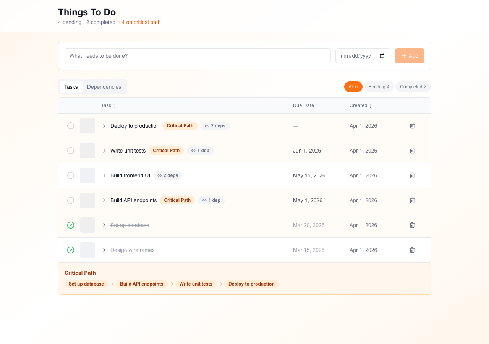
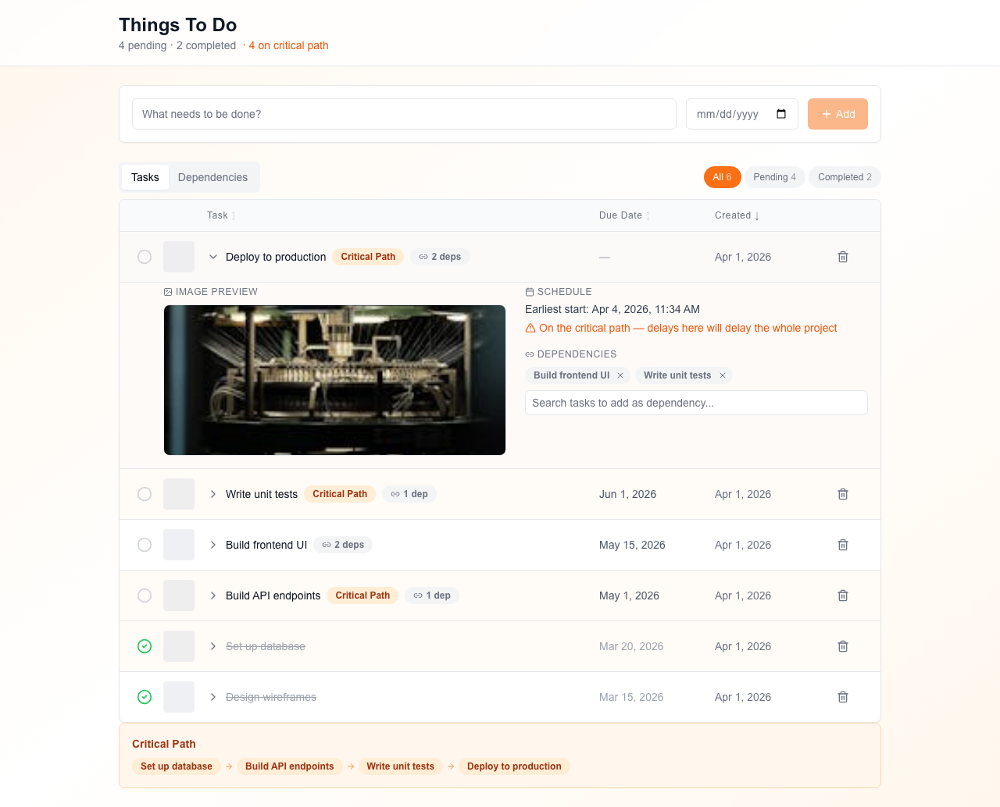
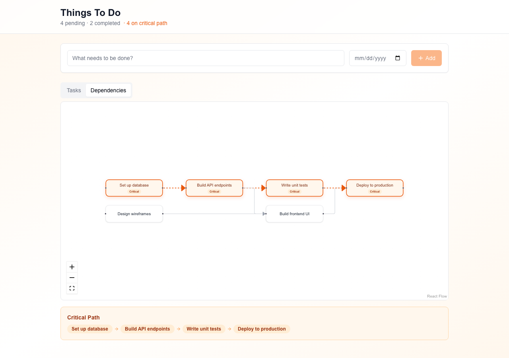

## Soma Capital Technical Assessment

This is a technical assessment as part of the interview process for Soma Capital.

> [!IMPORTANT]  
> You will need a Pexels API key to complete the technical assessment portion of the application. You can sign up for a free API key at https://www.pexels.com/api/  

To begin, clone this repository to your local machine.

## Development

This is a [NextJS](https://nextjs.org) app, with a SQLite based backend, intended to be run with the LTS version of Node.

To run the development server:

```bash
npm i
npm run dev
```

## Task:

Modify the code to add support for due dates, image previews, and task dependencies.

### Part 1: Due Dates 

When a new task is created, users should be able to set a due date.

When showing the task list is shown, it must display the due date, and if the date is past the current time, the due date should be in red.

### Part 2: Image Generation 

When a todo is created, search for and display a relevant image to visualize the task to be done. 

To do this, make a request to the [Pexels API](https://www.pexels.com/api/) using the task description as a search query. Display the returned image to the user within the appropriate todo item. While the image is being loaded, indicate a loading state.

You will need to sign up for a free Pexels API key to make the fetch request. 

### Part 3: Task Dependencies

Implement a task dependency system that allows tasks to depend on other tasks. The system must:

1. Allow tasks to have multiple dependencies
2. Prevent circular dependencies
3. Show the critical path
4. Calculate the earliest possible start date for each task based on its dependencies
5. Visualize the dependency graph

## Submission:

1. Add a new "Solution" section to this README with a description and screenshot or recording of your solution. 
2. Push your changes to a public GitHub repository.
3. Submit a link to your repository in the application form.

Thanks for your time and effort. We'll be in touch soon!

## Solution

### Setup

```bash
npm install
```

Create a `.env.local` file with your Pexels API key:

```
PEXELS_API_KEY=your_key_here
```

Run the development server:

```bash
npm run dev
```

### Screenshots

**Task list** — inline image thumbnails, sortable columns, overdue dates in red, critical path badges:



**Expanded row** — larger image preview (click to open full-size dialog), earliest start date, dependency management:



**Dependency graph** — interactive React Flow visualization with critical path highlighted in orange:



### Part 1: Due Dates

- Added an optional `dueDate` field to the Todo model (Prisma/SQLite).
- Inline date picker in the task creation row.
- Sortable due date column in the task table — click to sort ascending/descending.
- Overdue dates are highlighted in **red** with a warning icon for clear visual distinction.

### Part 2: Image Previews (Pexels API)

- When a todo is created, the server-side API route queries the Pexels API using the task title as a search query.
- The first matching image URL is stored in the database and displayed as an **inline thumbnail** directly in each task row — visible without any extra clicks.
- An **animated skeleton placeholder** is shown while each image loads in the browser, with a smooth opacity transition on load.
- Clicking the thumbnail in the expanded row opens a **full-size preview dialog** (Radix Dialog).
- An **animated spinner** loading state is shown on the Add button while the task and image are being fetched.
- The Pexels API key is stored in `.env.local` (server-side only, never exposed to the client).

### Part 3: Task Dependencies

- **Data model**: A `TodoDependency` join table with a unique constraint on `(todoId, dependsOnId)` to prevent duplicate edges.
- **Multiple dependencies**: Expanding a task row reveals a dependency section with **search-based dependency selector**. The dropdown opens on focus showing all valid options, and supports filtering by typing.
- **Circular dependency prevention**: Cycle detection runs **both client-side** (DFS reachability — invalid options are filtered out of the selector entirely) **and server-side** (BFS traversal rejects the mutation with a clear error). This provides a seamless UX where users simply cannot select invalid dependencies.
- **Critical path**: Computed client-side using topological sort (Kahn's algorithm) with a forward pass to find earliest start/finish times, then tracing back from the latest-finishing task to identify the longest path. Critical path tasks are highlighted with an orange badge and row tint.
- **Earliest start dates**: Calculated for each task based on its dependency chain. Displayed in the expanded row detail for tasks that have dependencies, with a warning about critical path impact.
- **Interactive dependency graph** (React Flow): Switching to the "Dependencies" tab shows a draggable, zoomable graph with:
  - Hierarchical left-to-right layout by topological level
  - Smooth animated edges on the critical path (orange, animated dash)
  - Non-critical edges dimmed in gray
  - Draggable nodes with zoom/pan controls
  - Critical path summary badge strip below the graph

### Beyond the Requirements

- **Task completion**: Click the circle icon to mark tasks done. Completed tasks show with strikethrough text and muted styling. Overdue indicators are hidden for completed tasks.
- **Status filters**: Filter by All / Pending / Completed with live counts. Filter state is persisted in the URL via **nuqs** for shareability (e.g. `?status=pending&tab=dependencies`).
- **Multi-select dependencies**: Select multiple dependency targets at once with checkboxes, then confirm with a single "Add N dependencies" button.
- **Server Components + Server Actions**: The page is a server component that fetches data server-side (no client-side waterfall). All mutations run as server actions. REST API routes are also available for programmatic access.
- **Optimistic UI**: Toggling task completion updates instantly before the server round-trip.

### Tech Choices

- **Server Components + Server Actions**: Data fetching via Prisma with no client-side waterfall; only interactive leaves are client components
- **shadcn/ui** (Radix + Tailwind + CVA): Consistent, accessible component library (Button, Badge, Tabs, Dialog)
- **React Flow**: Interactive dependency graph with pan/zoom, drag, and animated edges
- **nuqs**: Tab and filter state persisted in the URL for shareability
- **Prisma + SQLite**: Simple relational backend with typed ORM
- **Pure graph functions** (`lib/graph.ts`): Topological sort, critical path, and reachability as testable pure functions
- **Lucide icons**: Consistent iconography throughout
